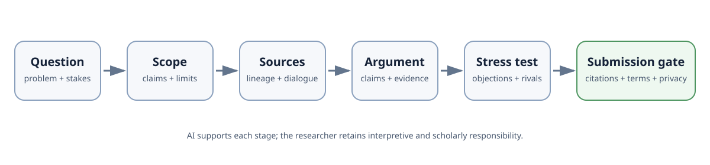
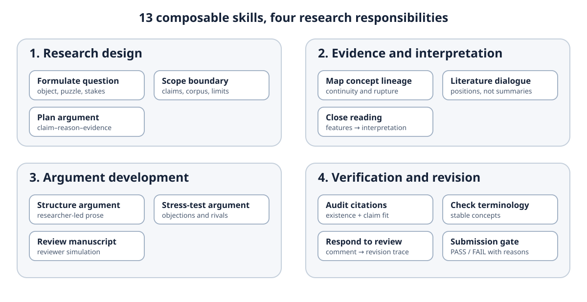
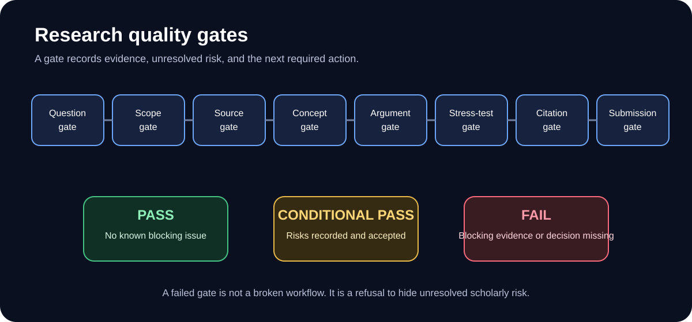

# Humanities Superpowers

[English](README.md) · [설치](INSTALLATION.md) · [방법론 백서](docs/white-paper/HUMANITIES_SUPERPOWERS_WHITE_PAPER.md) · [선언문](MANIFESTO.md)

**AI 에이전트를 사용하는 인문학 연구자를 위한 구조화된 연구 스킬과 품질 게이트입니다.**

> **AI 논문 대필 도구가 아니라, 학술적 판단을 지지하는 발판입니다.**

Humanities Superpowers는 유창한 AI 산출물이 가장 위험해지는 순간을 늦추고 점검합니다. 연구 질문 형성, 개념 정의, 주장과 근거 연결, 반론 검토, 인용 검증, 제출 가능 여부 판단을 명시적인 절차로 바꿉니다.

13개 핵심 연구 스킬과 그중 필요한 최소 경로를 선택하는 1개의 Level 3 라우터를 제공합니다. AI는 정리하고 비교하며 문제를 표시할 수 있지만, 해석, 출처 확인, 윤리적 판단, 개념적 선택, 최종 저자 책임을 대신하거나 원고의 게재 가능 상태를 보장하지 않습니다.

<p align="center"></p>

## 빠른 시작

```bash
git clone https://github.com/icerain-cmd/humanities-superpowers.git
cd humanities-superpowers
python3 scripts/validate_repository.py
```

Windows에서 `python3` 명령을 찾지 못하면 `python`을 사용하십시오.

`skills/` 폴더를 사용하는 에이전트의 스킬 디렉터리에 복사하거나 [INSTALLATION.md](INSTALLATION.md)를 따르십시오.

예시 명령:

> Humanities Superpowers를 사용해 인공자연과 플랫폼 미학에 관한 연구 질문을 만들어라. 확인된 근거, 해석, 추론, 가설, 미확인 사항을 구분하고 출처를 만들지 마라.

전체 작업 흐름을 실행하려면 다음과 같이 요청할 수 있습니다.

> `workflows/write-a-paper.md`를 따르되, 각 품질 게이트에서 멈추고 다음 단계로 가기 전에 해결되지 않은 위험을 보고하라.

## 검증 및 호환 상태

**실제 설치·검증 완료:** Claude Code, OpenAI Codex.

**설치 안내는 제공하지만 독립적인 로딩 검증은 미완료:** Cursor.

그 밖의 Markdown 기반 에이전트에서도 수동으로 사용할 수 있으나 호환성을 보장하지 않습니다. 검증된 프로젝트 구조, 파일 수 확인법, 원본을 읽기 전용으로 보존하는 파일럿 절차는 [INSTALLATION.md](INSTALLATION.md)를 참조하십시오.

## 핵심 원칙

- **문장보다 연구가 먼저다.**
- **자신감보다 근거가 우선한다.**
- **모른다는 표시는 허위 완성보다 낫다.**
- **개념은 계보와 경계를 가져야 한다.**
- **완료는 선언이 아니라 검증되어야 한다.**

자세한 이론적 설명은 [방법론 백서](docs/white-paper/HUMANITIES_SUPERPOWERS_WHITE_PAPER.md), [프로젝트 철학](docs/PHILOSOPHY.md), [설계 원칙](docs/DESIGN_PRINCIPLES.md)에서 확인할 수 있습니다.

## 13개 핵심 연구 스킬 + 1개 Level 3 라우터

<p align="center"></p>

1. 연구 질문 형성
2. 논증 범위 설정
3. 개념 계보 작성
4. 선행연구 대화 구조화
5. 인문학 논증 설계
6. 정밀 읽기
7. 연구자 논증 구조화
8. 논증 스트레스 테스트
9. 인용 감사
10. 용어 일관성 점검
11. 원고 심사
12. 심사의견 대응
13. 제출 전 최종 검증

각 스킬은 호출 조건, 필수 입력, 절차, 중단 신호, 허위 생성 방지 규칙, 완료 기준, 출력 형식, 다음 단계로 구성됩니다.

별도의 `using-humanities-superpowers` 라우터가 연구 상태를 진단하고 13개 핵심 연구 스킬 가운데 필요한 경로를 선택합니다. 따라서 저장소에는 13개 핵심 연구 스킬과 1개 라우터, 모두 14개의 `SKILL.md` 파일이 있습니다.

## 연구 품질 게이트

<p align="center"></p>

게이트는 `PASS`, `CONDITIONAL PASS`, `FAIL` 중 하나를 반환합니다. 필요한 근거나 판단이 없으면 실패해야 합니다. 실패는 시스템 오류가 아니라 미해결 학술 위험을 숨기지 않는 장치입니다.

## 인간과 AI의 책임 구분

AI는 자료를 정리하고 비교하며 논증을 점검하고 위험을 표시할 수 있습니다. 연구의 중요성, 해석, 출처 검증, 윤리, 개념적 선택, AI 사용 공개와 최종 저자 책임은 연구자에게 남습니다.

## 예제

[Artificial Nature and Platform Mediation](examples/concept-paper-example/README.md) 예제는 연구 브리프부터 최종 검증까지 진행됩니다. 최종 결과는 의도적으로 `FAIL`입니다. 검증된 출처 묶음이 없기 때문에 제출 가능 판정을 거부합니다.

집중 예제:

- [논증 지도](examples/argument-map-example/README.md)
- [용어 일관성 감사](examples/terminology-audit-example/README.md)

## 보장하지 않는 것

이 프로젝트는 진실, 독창성, 게재, 인용 정확성을 보장하지 않습니다. AI를 자율적인 학자로 만들지도 않습니다. 대신 근거와 해석, 추론과 가설, 확인과 미확인을 분리하고 연구자가 검토해야 할 위험을 드러냅니다.

## 기원과 독립성

이 프로젝트는 코딩 에이전트를 위한 조합형 스킬 방법론인 Jesse Vincent의 [`obra/superpowers`](https://github.com/obra/superpowers)에서 구조적 영감을 받았습니다. 그러나 인문학 연구 절차와 스킬 본문은 독립적으로 설계되었습니다.

Jesse Vincent, Prime Radiant 또는 Superpowers 프로젝트와 제휴·승인·공동 관리 관계가 아닙니다. 자세한 내용은 [ACKNOWLEDGMENTS.md](ACKNOWLEDGMENTS.md), [DIFFERENCES.md](DIFFERENCES.md), [THIRD_PARTY_NOTICES.md](THIRD_PARTY_NOTICES.md)를 참조하십시오.

## 저자

**이용욱(Lee Yong Wook)** · 전주대학교  
GitHub: [`@icerain-cmd`](https://github.com/icerain-cmd) · [icerain@jj.ac.kr](mailto:icerain@jj.ac.kr)

MIT License로 공개합니다.

기여 전에 [CONTRIBUTING.md](CONTRIBUTING.md)를 읽어 주십시오. 인용 정보는 [CITATION.cff](CITATION.cff), 라이선스 전문은 [LICENSE](LICENSE)에서 확인할 수 있습니다.


## 연구 오케스트레이션

Level 3 라우터는 현재 연구 상태를 진단하고, 필요한 최소 스킬 경로를 선택하며, 실패한 게이트를 숨기지 않고 중단·되돌림의 근거로 사용합니다. 명시적인 세션 기록으로 작업을 이어갈 수 있지만, 그 기록을 학술적 근거로 취급하지 않습니다.

- [연구 상태 머신](docs/orchestration/RESEARCH_STATE_MACHINE.md)
- [라우팅과 되돌림](docs/orchestration/ROUTING_AND_ROLLBACK.md)
- [세션 메모리](docs/orchestration/SESSION_MEMORY.md)

## 문서 사이트

GitHub Pages 배포를 위한 MkDocs Material 사이트가 포함되어 있습니다. 저장소의 **Settings → Pages → GitHub Actions**를 활성화하면 `main` 브랜치 변경 시 자동 배포됩니다.

## 공개 릴리스 상태

v1.0.0 릴리스 노트와 최종 공개 체크리스트는 [`docs/release/`](docs/release/)에서 확인할 수 있습니다.


## SNS 공개문 모음

- [SNS 공개문 모음](docs/social-media-kit/README.md)
