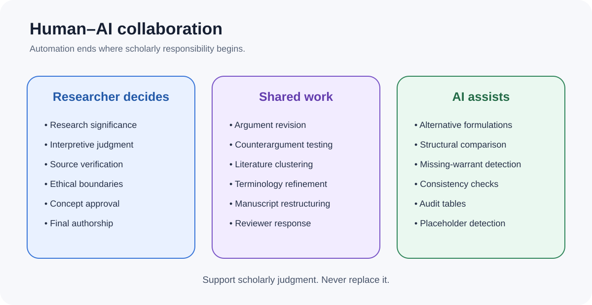

# Humanities Superpowers

[한국어](README.ko.md) · [Documentation](https://icerain-cmd.github.io/humanities-superpowers/) · [Quick start](INSTALLATION.md) · [White paper](docs/white-paper/HUMANITIES_SUPERPOWERS_WHITE_PAPER.md) · [Manifesto](MANIFESTO.md) · [Examples](#worked-examples)

**Structured research skills and quality gates for humanities scholars using AI agents.**

> **Use AI without surrendering scholarly judgment.**  
> Not an AI paper writer. A scholarly judgment scaffold.

Humanities Superpowers is designed to slow down the moments where fluent AI output is most dangerous: framing a question, defining concepts, connecting claims to evidence, testing objections, checking citations, revising judgments, and deciding whether a manuscript is ready to submit.

It provides 13 core research skills and one Level 3 router that selects the smallest valid route through them. It supports scholarly judgment; it does not replace interpretation, source verification, ethics, or authorship, and it does not promise a publication-ready manuscript.

Version 2.1.0, **Dual-Core**, adds a vendored engineering core for software work beside the unchanged research protocol. Version 2.0, **Fricturn**, made interpretive friction, traceable scholarly judgment, and epistemic return explicit. AI provides fluency; humanities provides friction. Neither addition replaces the project's primary identity: **Use AI without surrendering scholarly judgment.**

## Critical testing invited

The initial goal is to recruit **10 humanities researchers** willing to test one research skill on a real project and report where the framework is too rigid, too technical, or methodologically weak. For Fricturn, criticism is especially valuable where the protocol misidentifies scholarly friction, over-formalizes ordinary interpretation, or obscures rather than preserves human judgment.

- [Submit a test report](https://github.com/icerain-cmd/humanities-superpowers/issues/new?template=test_report.yml)
- [Offer methodological criticism](https://github.com/icerain-cmd/humanities-superpowers/issues/new?template=methodological_criticism.yml)
- [Report an installation problem](https://github.com/icerain-cmd/humanities-superpowers/issues/new?template=installation_problem.yml)
- [Join a broader discussion](https://github.com/icerain-cmd/humanities-superpowers/discussions)

Literary scholars, historians, philosophers, digital humanists, DH librarians, graduate researchers, and scholars working in languages other than English are especially welcome. Do not post unpublished manuscripts, personal data, reviewer identities, or copyrighted source text; use anonymized descriptions and minimal excerpts.

<p align="center"></p>

## Quick start

```bash
git clone https://github.com/icerain-cmd/humanities-superpowers.git
cd humanities-superpowers
python3 scripts/validate_repository.py
```

On Windows, use `python` instead of `python3` if that is the available launcher.

Copy `skills/` into your agent's skill directory, or follow [INSTALLATION.md](INSTALLATION.md).

Then ask:

> Use Humanities Superpowers to formulate a research question about artificial nature and platform aesthetics. Separate verified evidence, interpretation, inference, hypothesis, and unknowns. Do not invent sources.

For a complete workflow:

> Follow `workflows/write-a-paper.md`. Stop at every quality gate and report unresolved risks before proceeding.

## Verification and compatibility

**Tested:** Claude Code and OpenAI Codex.

**Installation guidance provided, but not yet independently verified:** Cursor.

Other Markdown-capable agents may use the skills manually, but compatibility is not guaranteed. Product conventions can change; see [INSTALLATION.md](INSTALLATION.md) for the tested project layouts, file-count checks, and a read-only pilot workflow.

## Why it exists

AI agents can produce polished academic prose before the underlying research has been verified. Humanities research requires a different discipline: conceptual lineage, close reading, argumentative restraint, traceable evidence, serious counterarguments, and explicit uncertainty.

The framework therefore organizes work around three commitments:

- **Research before prose**
- **Evidence over confidence**
- **Completion must be demonstrated**
- **Conflict must not be silently harmonized**
- **Changed knowledge may reopen earlier inquiry**

Read the [methodology white paper](docs/white-paper/HUMANITIES_SUPERPOWERS_WHITE_PAPER.md), [project philosophy](docs/PHILOSOPHY.md), and [design principles](docs/DESIGN_PRINCIPLES.md).

## 13 core research skills + 1 Level 3 router

<p align="center"></p>

| Research responsibility | Skill |
|---|---|
| Turn a topic into an arguable question | `formulating-research-question` |
| Define what the argument will and will not claim | `scoping-argument-boundary` |
| Trace a concept across thinkers and contexts | `mapping-concept-lineage` |
| Turn sources into a scholarly conversation, not a summary list | `conducting-literature-dialogue` |
| Build a claim–reason–evidence structure | `planning-humanities-argument` |
| Analyze passages, images, and media artifacts closely | `performing-close-reading` |
| Structure the researcher's argument without ghostwriting it | `structuring-humanities-argument` |
| Attack the argument before reviewers do | `stress-testing-argument` |
| Verify citation existence and claim–source fit | `auditing-citations` |
| Keep concepts and translations stable | `checking-terminology-consistency` |
| Simulate a rigorous manuscript review | `reviewing-manuscript` |
| Convert reviews into traceable revisions | `responding-to-peer-review` |
| Run a final PASS/FAIL submission gate | `verifying-before-submission` |

Each skill defines invocation conditions, required inputs, a procedure, stop signals, anti-fabrication rules, completion criteria, output records, and next steps.

The separate `using-humanities-superpowers` router diagnoses research state and selects among these 13 core skills. The repository therefore contains 14 `SKILL.md` files: 13 core research skills and 1 router.

## Research quality gates

<p align="center"></p>

A gate returns:

- `PASS` — no known blocking issue remains;
- `CONDITIONAL PASS` — recorded risks are explicitly accepted;
- `FAIL` — evidence, verification, or researcher judgment is still missing.

A failed gate is not a broken workflow. It is a refusal to hide unresolved scholarly risk. See [QUALITY_GATES.md](docs/QUALITY_GATES.md).

## Human–AI division of responsibility

<p align="center"></p>

AI may organize, compare, test, and flag. The researcher remains responsible for significance, interpretation, source verification, ethics, conceptual commitments, disclosure, and final authorship.

## Worked examples

### End-to-end concept paper

[Artificial Nature and Platform Mediation](examples/concept-paper-example/README.md) runs from a research brief through question formation, scope, concept lineage, argument mapping, terminology control, citation audit, and final verification.

**The final gate intentionally returns `FAIL`.** No verified source set is supplied, so the framework refuses to label the project publication-ready. This is expected behavior.

### Focused examples

- [Argument-map example](examples/argument-map-example/README.md)
- [Terminology-audit example](examples/terminology-audit-example/README.md)
- [Conflicting evidence](examples/conflicting-evidence-example/README.md)
- [Rival interpretation](examples/rival-interpretation-example/README.md)
- [Epistemic return](examples/epistemic-return-example/README.md)
- [Judgment history](examples/judgment-history-example/README.md)

## Fricturn protocol

Fricturn distinguishes source verification from evidential standing, stores agent recommendations separately from researcher decisions, preserves interpretation history, and tracks whether a historical gate result remains valid after dependencies change. See the [v2 specification](docs/specification/v2/README.md) and [Humanities Engineering](docs/methodology/HUMANITIES_ENGINEERING.md).

## Dual-Core: Humanities and Engineering

Version 2.1.0 ships a second core beside the research protocol.

The Humanities core is unchanged: 13 research skills plus the router, the same gates, the same separation of historical status from current validity, and the same human authority. The Engineering core is a partial, **unmodified** vendored import of [`obra/superpowers`](https://github.com/obra/superpowers) 6.3.0 (MIT, Copyright (c) 2025 Jesse Vincent). Ten of its fourteen skills are imported; import commit, per-skill hashes, and the reason for every excluded skill are recorded in `vendor/obra-superpowers/PROVENANCE.json`.

```text
                  Router
                     |
        -----------------------------
        |             |             |
     RESEARCH       CODE        HYBRID
        |             |             |
   Humanities   Engineering    Both cores
      Core          Core
```

The router treats these as one entry point with two axes:

- **Domain** — `RESEARCH`, `CODE`, or `HYBRID`. A citation review is research; a spacing fix is code; fixing the citation verifier itself is hybrid, and a code change that alters how research artifacts are produced can invalidate affected gates.
- **Risk** — `QUICK`, `STANDARD`, or `STRICT`, applied to `CODE` and `HYBRID` work, derived from properties (reversibility, blast radius, privilege boundary, persistence, contract surface, environment, failure cost, uncertainty) rather than keywords. A localized edit stays small; a SYSTEM-owned scheduled task is `STRICT`.

Unattended work reports `WORKING`, `WAITING_INPUT`, `WAITING_PRIVILEGE`, `BLOCKED`, `ERROR`, or `DONE`, where `DONE` requires a completion verification record and `WAITING_PRIVILEGE` names an elevation boundary the agent cannot cross. Handoffs use a `WORK_PACKAGE` and an `EVIDENCE_PACKAGE` between role-based `PLANNER`, `IMPLEMENTER`, `REVIEWER`, and `ESCALATION_REVIEWER` assignments; model names live only in a replaceable operating profile.

The worker states are a contract, not a runtime: no Telegram, Hermes, or other notification runtime is implemented.

### What v2.1.0 does not claim, and what the evaluation found

v2.1.0 provides systematic engineering workflows. That is a description of function, not of effect.

An effectiveness evaluation has been conducted — one model, six author-labelled fixtures, two repetitions per condition, in three separate tracks. **It does not support enabling HSP-v2 by default.**

| Core | Status after the evaluation |
|---|---|
| Research core | `EXPERIMENTAL_ONLY` — the difference over control appeared on one fixture and one repetition, did not reproduce, and cost the same in tokens |
| Engineering core, single-response contract | `REJECT_CURRENT_DESIGN` — the one-shot work/evidence contract was not produced correctly and invited verification narration that no tool run supported |
| Engineering core, tool-use form | `EXPERIMENTAL_ONLY` — verification claims were grounded in real tool evidence in both conditions, but the advantage was narrow and cost roughly a quarter more tokens |

**Default policy: `OFF`.** Enable the framework selectively, where external evidence decides the answer — citation and source verification, file or configuration verification, test-execution verification, and work where withholding a conclusion when evidence is missing matters more than producing one. It is not justified as a default for general writing, general coding, or simple questions.

This release claims no coding-quality improvement, no defect reduction, no token saving, and no research-quality improvement for either core. The three tracks are kept apart on purpose. The measured numbers, the stability analysis, the historical-versus-current benchmark distinction, and the evidence-before-claim rule are recorded in [docs/evaluation/EFFECTIVENESS_AND_OPERATING_POLICY.md](docs/evaluation/EFFECTIVENESS_AND_OPERATING_POLICY.md); the harnesses are described in [docs/evaluation/HSP_COMPARISON_HARNESS.md](docs/evaluation/HSP_COMPARISON_HARNESS.md) and [docs/evaluation/TOOL_USE_BENCHMARK.md](docs/evaluation/TOOL_USE_BENCHMARK.md).

## What this project does not claim

Humanities Superpowers does not guarantee truth, originality, acceptance, or citation accuracy. It does not turn an AI agent into an autonomous scholar. Its design intent is to reduce avoidable risk by making assumptions, evidence, unresolved verification, and researcher decisions visible.

That intent is not a measured result. The repository ships controlled comparison harnesses that can test it, and the recorded evaluation is reported in [docs/evaluation/EFFECTIVENESS_AND_OPERATING_POLICY.md](docs/evaluation/EFFECTIVENESS_AND_OPERATING_POLICY.md); metrics that were not measured stay `NOT_MEASURED`. A passing repository validation and a passing installation check demonstrate internal consistency, not research benefit.

See [ANTI_PATTERNS.md](docs/ANTI_PATTERNS.md) for common failure modes.

## Origin and independence

Humanities Superpowers was inspired by Jesse Vincent's [`obra/superpowers`](https://github.com/obra/superpowers), which applies composable skills and systematic verification to coding agents. This project independently adapts that general design idea to humanities research.

It is not affiliated with, endorsed by, or maintained by Jesse Vincent, Prime Radiant, or the Superpowers project. See [ACKNOWLEDGMENTS.md](ACKNOWLEDGMENTS.md), [DIFFERENCES.md](DIFFERENCES.md), and [THIRD_PARTY_NOTICES.md](THIRD_PARTY_NOTICES.md).

## Author

**Lee Yong Wook** · Jeonju University  
GitHub: [`@icerain-cmd`](https://github.com/icerain-cmd) · [icerain@jj.ac.kr](mailto:icerain@jj.ac.kr)

## Contributing, citation, and license

Read [CONTRIBUTING.md](CONTRIBUTING.md) before opening an issue or pull request. Citation metadata is provided in [CITATION.cff](CITATION.cff). Released under the [MIT License](LICENSE).

## Research orchestration

The Level 3 router diagnoses the current research state, selects the smallest valid skill route, and treats failed gates as reasons to pause or roll back—not as obstacles to hide. It can preserve a resumable session record without treating memory as evidence.

- [Research state machine](docs/orchestration/RESEARCH_STATE_MACHINE.md)
- [Routing and rollback](docs/orchestration/ROUTING_AND_ROLLBACK.md)
- [Session memory](docs/orchestration/SESSION_MEMORY.md)

## Documentation site

The live documentation is published at [icerain-cmd.github.io/humanities-superpowers](https://icerain-cmd.github.io/humanities-superpowers/). It is built with MkDocs Material and deployed from `main` through GitHub Actions.

## Public release status

The current release notes are [v2.1.0 — Dual-Core](docs/release/RELEASE_NOTES_v2.1.0.md). Earlier notes ([v2.0.0 — Fricturn](docs/release/RELEASE_NOTES_v2.0.0.md), [v1.0.0](docs/release/RELEASE_NOTES_v1.0.0.md)) and the final publication checklist are available in [`docs/release/`](docs/release/).

## Social media launch kit

- [Social media launch kit](docs/social-media-kit/README.md)
